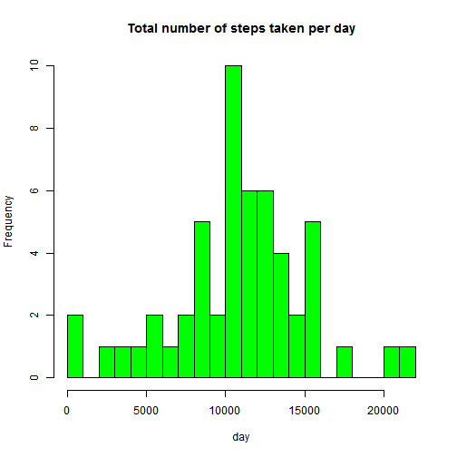
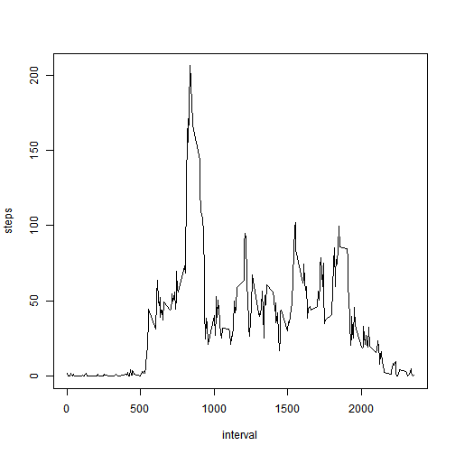
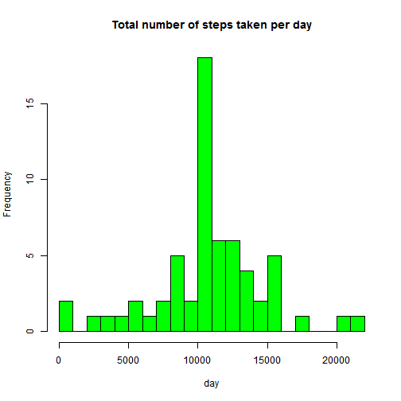
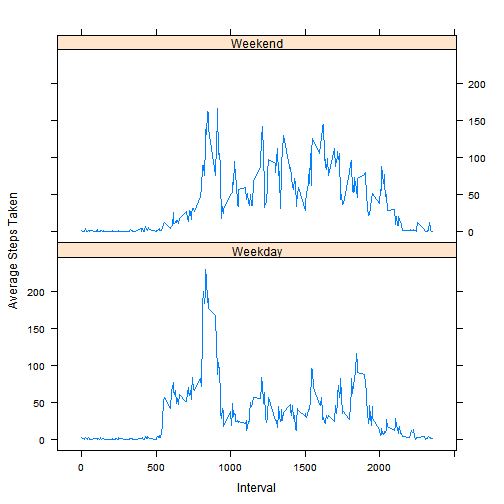

# Peer Assessment 1

============================================

## Loading and preprocessing the data
1. load the data


```r
unzip(zipfile="activity.zip")
```

```
## Warning in unzip(zipfile = "activity.zip"): error 1 in extracting from zip
## file
```

```r
activity <- read.csv("activity.csv", sep = ",", header = TRUE)
```

2. transform the data into a format suitable for analysis


```r
activity$date <- as.Date(activity$date,,"%Y-%m-%d")
```

## What is mean total number of steps taken per day?
1. calculate the total number of steps taken per day


```r
daily.steps <- aggregate(steps ~ date,data = activity,FUN = sum,na.rm = TRUE)
```

2. make a histogram of the total number of steps taken each day


```r
hist(daily.steps$steps,main = "Total number of steps taken per day",xlab = "day",col = "green",breaks = 20)
```

 

3. calculate and report the mean and median of the total number of steps taken per day


```r
mean(daily.steps$steps)
```

```
## [1] 10766.19
```

```r
median(daily.steps$steps)
```

```
## [1] 10765
```

## What is the average daily activity pattern?
1. make a time series plot of the 5-minute interval (x-axis) and the average number of steps taken(y-axis)


```r
interval.steps <- aggregate(steps ~ interval,data = activity,FUN = mean,na.rm = TRUE)
plot(interval.steps, type = "l")
```

 

2. which 5-minute interval, on average across all the days in the dataset, contains the maximum number of steps?


```r
interval.steps$interval[which.max(interval.steps$steps)]
```

```
## [1] 835
```

## Imputing missing values
1. calculate and report the total number of missing values in the dataset


```r
missing <- sum(is.na(activity))
```

2. devise a strategy for filling in all of the missing values in the dataset


```r
fill.steps <- function(steps, interval) {
    filled <- NA
    if (!is.na(steps))
        filled <- c(steps)
    else
        filled <- (interval.steps[interval.steps$interval==interval, "steps"])
    return(filled)
}
```

3. create a new dataset that is equal to the original dataset but with the missing data filled in


```r
fill.activity <- activity
fill.activity$steps <- mapply(fill.steps,fill.activity$steps,fill.activity$interval)
```

4. make a histogram of the total number of steps taken each day and Calculate and report the mean and median total number of steps taken per day


```r
fill.dailysteps <- aggregate(steps ~ date,data = fill.activity,FUN = sum,na.rm = TRUE)
hist(fill.dailysteps$steps, main = "Total number of steps taken per day", xlab = "day", col = "green", breaks = 20)
```

 

```r
mean(fill.dailysteps$steps)
```

```
## [1] 10766.19
```

```r
median(fill.dailysteps$steps)
```

```
## [1] 10766.19
```
### Mean and median values are higher after imputing missing data, because in the original data, there are some days when steps values are NA, so the total number of steps taken in such days are set to 0. After replacing missing steps values with the mean steps of associated interval value, the 0 are removed from the histogram.

## Are there differences in activity patterns between weekdays and weekends?
1. create a new factor variable in the dataset with two levels


```r
fill.activity["date"] <- as.Date(fill.activity$date, "%Y-%m-%d")
fill.activity[(weekdays(fill.activity$date) %in% c("Saturday", "Sunday")), "level"] <- "Weekend"
fill.activity[!(weekdays(fill.activity$date) %in% c("Saturday", "Sunday")), "level"] <- "Weekday"
new.dailysteps <- aggregate(steps ~ interval + level, data = fill.activity, mean)
names(new.dailysteps) <- c("interval", "level", "steps")
```

2. make a panel plot containing a time series plot of the 5-minute interval (x-axis) and the average number of steps taken (y-axis)


```r
library(lattice)
p <- xyplot(steps ~ interval | factor(level),data = new.dailysteps,type = 'l',layout = c(1, 2),xlab = "Interval",ylab = "Average Steps Taken")
print(p)
```

 
